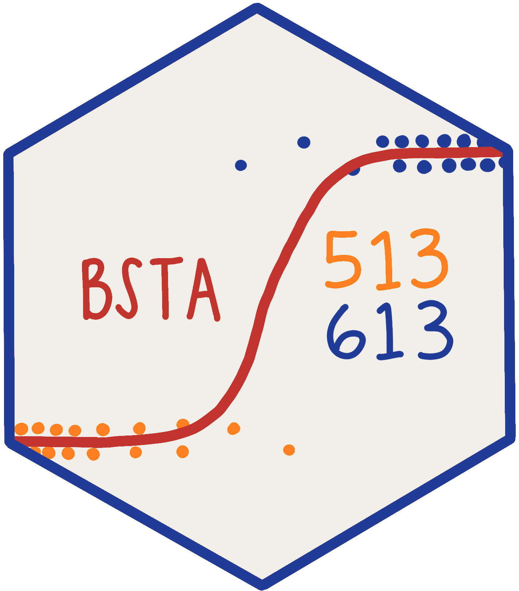

:::::: columns
::: {.column width="30%"}

:::

::: {.column width="5%"}
:::

::: {.column width="65%"}

::: columns
::: {.column width="24%"}
::: link-orange
[Spring 2026](https://nwakim.github.io/BSTA_513_26S/) 
:::
:::
::: {.column width="1%"}
:::
::: {.column width="24%"}
::: link-orange
[Spring 2025](https://nwakim.github.io/BSTA_513_S25/)
:::
:::
::: {.column width="1%"}
:::
::: {.column width="24%"}
::: link-orange
[Spring 2024](https://nwakim.github.io/S2024_BSTA_513/)
:::
:::
::: {.column width="1%"}
:::
::: {.column width="24%"}
::: link-orange
Spring 2023
:::
:::
:::

This course covers the analysis of categorical data, including contingency tables, logistic regression, and other related topics. It is designed for students who have a background in statistics and are interested in applying statistical methods to categorical data. In this course, we will continue to learn about regression analysis, but not with categorical outcomes. We will build some theoretical understanding in order to interpret and apply logistic regression models appropriately. We will learn how to build a logistic regression model, interpret the model and coefficients, and diagnose potential issues with our model.
:::
::::::
