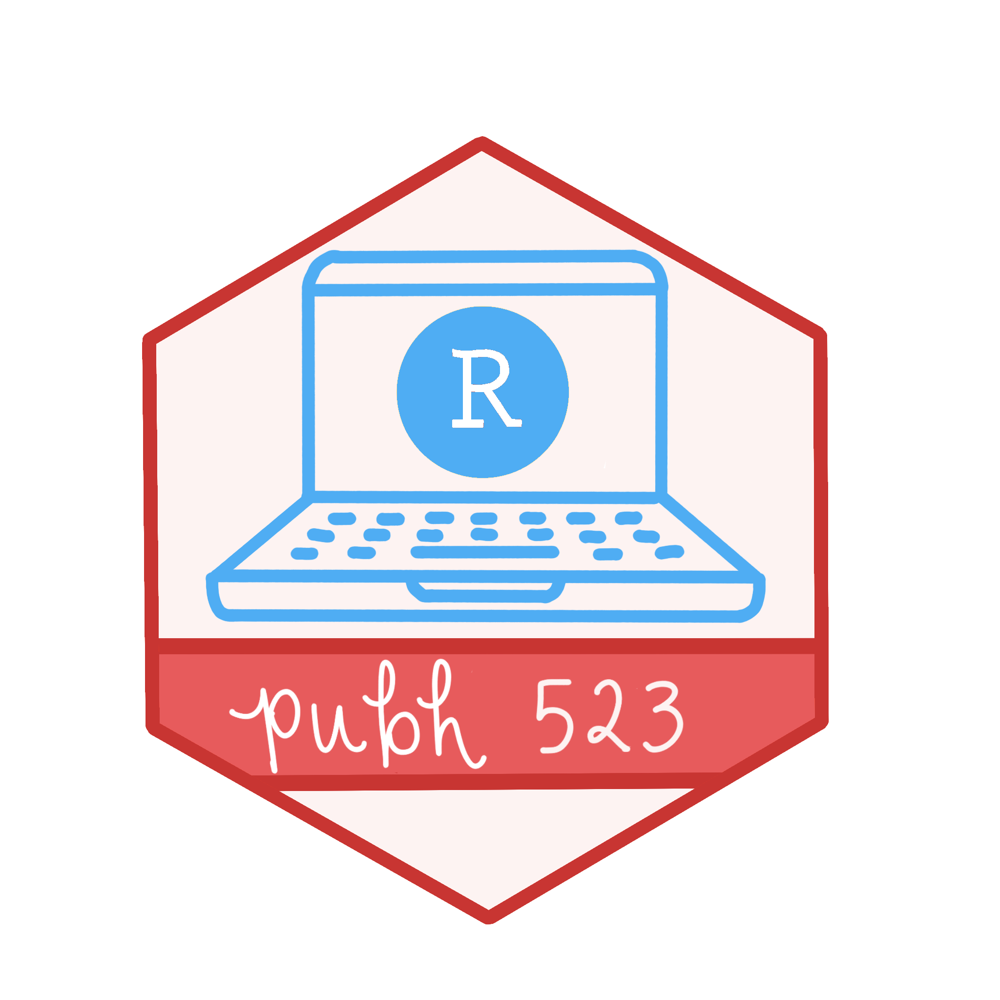

:::::: columns
::: {.column width="30%"}

:::

::: {.column width="5%"}
:::

::: {.column width="65%"}
[Summer 2026](https://nwakim.github.io/PUBH_523_26Su/)[Summer 2025](https://nwakim.github.io/BSTA_500_25Su/)

In this course, students will gain basic proficiency with the R environment and toolkit, focusing on reproducible workflows, data manipulation, visualization, and reporting. Topics include basic R programming, working in project-based folders, data transformations and summaries, data visualizations and plots, generating dynamic reports, and constructing summary tables.  By the end of the course, students will be comfortable initiating data exploration projects in R and will be prepared to apply these skills in further analysis courses. No prior statistical or coding experience is expected or required.
:::
::::::

